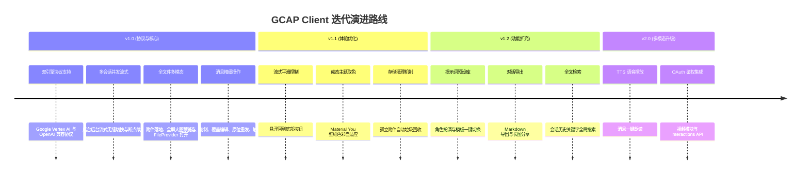

# GCAP Client — 项目审查与演进路线图 (Project Review & Roadmap)

> 本文档用于记录对当前 GCAP Client 项目的全面架构审查结果、现存优化空间及后续功能扩展规划，供后续迭代自查与执行参考。

---

## 📊 一、 当前项目状态与架构审计

### 1. 优势与已完成亮点
- **双协议引擎 1:1 严格对齐**：
  - **Google Agent Platform / Vertex AI**：完整支持 Format 1（多轮对话/思考）、Format 2（轻量对话）及 Format 4（生图）请求体构造与 SSE 流式解析；
  - **OpenAI 兼容协议 (OpenAI-Compatible)**：支持自定义 Base URL、API Key（Bearer 鉴权）、`/v1/models` 动态模型探测、多模态图文输入、`<think>`/`reasoning_content` 思维链折叠解析及 Base64 视频转码。
- **多会话后台并行流式生成 (Background Parallel Streaming)**：
  - 基于 `ActiveStreamState` 与 `ConcurrentHashMap` 管理后台流式协程任务，切换会话或新建会话时不中断后台接收，切回原会话无缝实时续显并可靠落库 Room。
- **会话级系统提示词与模型身份持久化 (Room Database v4)**：
  - `ConversationEntity` 持久化存储每个对话独立的 `systemInstruction` 与所选模型；
  - `MessageEntity` 存储生成该消息的真实具体模型名称（如 `deepseek-v4-flash`、`kimi-k3`、`glm-5.2` 等），彻底解决历史记录模型名称混乱与 Prompt 覆盖问题；新建对话时自动清空系统指令保持独立。
- **多模态全格式支持与应用内预览**：
  - 支持图片、视频、音频、PDF、代码及任意文档上传与 Base64 自动解析；
  - 用户/模型生成的图片均支持在应用内打开可缩放旋转的 **全屏大图预览弹窗（`FullScreenImageDialog`）** 并支持一键保存至相册；
  - 视频/音频/文档通过 `FileProvider` 安全生成 `content://` 授权，支持调用系统外部播放器与文档查看器。
- **现代化架构与精细交互**：
  - 全链路采用 Jetpack Compose + Material 3 + Hilt + Room (Upsert) + Flow + Kotlinx Serialization + Coil 3；
  - 模型回复全宽排版、思维链折叠胶囊、Markdown 代码块右上角一键复制与语言标牌、Google Search Grounding 网页来源追溯、Token 消耗统计；
  - 消息精细控制：文本任意划选、一键复制、模型回复原位覆盖编辑、用户消息原位截断重发、关键操作触觉反馈（`HapticFeedbackType`）。
- **底层稳定性**：
  - 大文件/大图自动落盘私有存储（`ImageStorageManager`），杜绝 SQLite 2MB CursorWindow 溢出；输入法避让与导航栏自动联动消除空白间隙。

---

## 🛠️ 二、 核心优化方向 (Optimizations)

### 1. 交互与动效体验 (UI/UX)
- [ ] **流式生成平滑滚动与“回到底部”悬浮按钮**
  - 当前多轮对话在长文本流式输出时，若用户向上滑动查看历史，应暂停自动滚动并显示“↓ 回到底部”微标浮钮；点击后平滑直达最新消息。
- [x] **触觉反馈 (Haptic Feedback)**
  - 发送消息、流式接收完成、一键复制、原位重发时已加入轻微系统振动（`HapticFeedbackType`），增强操作手感。
- [x] **代码块一键复制与语法高亮强化**
  - Markdown 渲染器中针对代码块已加入顶部语言标签（如 `Kotlin`, `Python`, `JSON`）及右上角一键复制代码按钮。
- [ ] **Material You 动态取色 (Dynamic Color)**
  - 在 Android 12+ 系统上支持跟随壁纸色彩主题，提供深色、浅色及壁纸动态取色的无缝切换。

### 2. 存储与性能优化 (Performance & Storage)
- [ ] **过期与无引用附件清理策略**
  - 当用户在侧边栏删除某个对话时，自动清理 `filesDir/attachments/` 中该对话所关联的孤立图片与多媒体文件，避免长期使用占用过多存储。
- [ ] **超长历史消息分页加载 (Paging 3)**
  - 当单个对话消息数超过数百条时，引入 Room + Paging 3 分页拉取，降低初始加载内存峰值。
- [ ] **网络重试与指数退避机制**
  - 在遇到临时性网络抖动或 HTTP 429（Rate Limit）时，自动执行退避重试或向用户展示清晰友好的重试按钮。

### 3. 错误诊断与用户反馈
- [ ] **错误明细智能提示**
  - 针对 API Key 无效（400 API_KEY_INVALID）、项目未开通 Vertex AI、地域受限（403 PERMISSION_DENIED）等场景，给出直接的引导提示与一键跳转 Google/OpenAI 服务商控制台链接。

---

## 🚀 三、 拟新增功能规划 (Feature Roadmap)

### 阶段一：效率与增强工具 (近期)
1. [x] **自定义端点 / 代理加速 (Custom Base URL / OpenAI API)**
   - 在设置中支持切换 OpenAI 兼容模式并自定义 Base URL / API Key，支持一键拉取模型列表。
2. [ ] **提示词预设与角色库 (Prompt Templates & Persona Presets)**
   - 在聊天界面提供预设模板抽屉（如：代码审查官、翻译专家、小说润色、周报生成等），支持用户一键载入 System Instruction。
3. [ ] **对话内容全文检索 (Full-text Search)**
   - 在侧边栏增加搜索栏，支持在所有历史会话中搜索关键词并一键高亮定位。
4. [ ] **对话导出与分享 (Export & Share)**
   - 支持将当前对话导出为标准 Markdown（`.md`）文件、纯文本（`.txt`）或生成长截图分享卡片。

### 阶段二：语音与多模态扩展 (中期)
1. **TTS 语音朗读 (Text-to-Speech)**
   - 在模型消息下方提供朗读按钮（`🔊`），支持调用系统 TTS 引擎或调用音频模型进行高自然度语音播放。
2. **语音输入 (Speech-to-Text / Audio Recording)**
   - 输入栏集成录音按钮，支持长按录音并直接作为音频附件发送给模型进行多模态语音理解。
3. **上下文窗口管理与 Token 监控 (Context Pruning)**
   - 在参数面板中实时展示当前会话的历史上下文总 Token 消耗，提供“清除上下文记忆（截断历史）”标记。

### 阶段三：视频与高级鉴权 (长期)
1. **OAuth 2.0 / Service Account 鉴权体系**
   - 适配 Google Sign-In 与 GCP Service Account JSON 密钥导入，解决 `Interactions API` 鉴权问题。
2. **视频生成与交互模块 (Gemini Omni Flash / Interactions)**
   - 重启视频模块，提供视频输入、帧率解析、视频生成及 ExoPlayer 视频流播放器。

---

## 📌 四、 版本演进路线概览

